<div align="center">

# 💪 Gym Tracker Pro
### 🚀 Progressive Web Application

<div>
  
  
  
  
  
</div>

<br>


<br>

<p>
  <strong>🎯 La aplicación definitiva para el seguimiento de entrenamientos en el gimnasio</strong>
</p>

<p>
  Desarrollada con las mejores tecnologías • Funciona completamente offline • Instalable en cualquier dispositivo
</p>

<div>
  <a href="https://pruebapwaggt.netlify.app/" target="_blank">
    
  </a>
  <a href="#-instalación-y-desarrollo">
    
  </a>
  <a href="#-capturas-de-instalación-pwa">
    
  </a>
</div>

---

### 📊 **Estadísticas del Proyecto**

<div align="center">

<table>
<tr>
<td align="center">
  
  <br><strong>🌐 Offline</strong>
</td>
<td align="center">
  
  <br><strong>⚡ Carga rápida</strong>
</td>
</tr>
</table>

</div>

---

</div>

## 🌟 **Características Destacadas**

<div align="center">

<table>
<tr>
<td align="center" width="50%">
  
### 📱 **Aplicaciones Web Progresivas**


- ✅ **Instalable** en escritorio y móvil
- ⚡ **Carga instantánea** con App Shell
- 🌐 **100% funcional offline** gracias al Service Worker
- 🔄 **Sincronización automática** cuando hay conexión
- 📲 **Experiencia nativa** en cualquier dispositivo

</td>
<td align="center" width="50%">

### 🎨 **Diseño Premium**


- 🌟 **Tema dorado premium** que inspira excelencia
- 🌙 **Modo oscuro optimizado** para uso en gimnasio
- 📐 **Diseño responsive** adaptado a todos los dispositivos
- ✨ **Animaciones fluidas** y transiciones suaves
- 🎯 **UX optimizada** para seguimiento de entrenamientos

</td>
</tr>
</table>

### 🔥 **Tecnologías de Utilizadas**

<div align="center">
<div>
  
  
  
</div>
</div>
</div>

---

## 📋 **Componentes PWA Implementados**

<div align="center">

### � **Componentes principales de PWA**

<table>
<tr>
<td align="center" width="33%">
  
  <br><br>
  <strong>📄 Manifest.json</strong>
  <br><em>Metadatos de instalación</em>
  <br>8 tamaños de iconos
  <br>Tema dorado premium
</td>
<td align="center" width="33%">
  
  <br><br>
  <strong>� Service Worker</strong>
  <br><em>Funcionalidad offline</em>
  <br>Cache-First Strategy
  <br>Background sync
</td>
<td align="center" width="33%">
  
  <br><br>
  <strong>📦 App Shell</strong>
  <br><em>Carga instantánea</em>
  <br>Estructura separada
  <br>Contenido dinámico
</td>
</tr>
</table>

</div>

### **1️⃣ Web App Manifest** (`public/manifest.json`)

<div align="center">

| Propiedad | Valor | Descripción |
|-----------|--------|-------------|
| `name` | "Gym Tracker Pro - Progressive Web App" | Nombre completo de la aplicación |
| `short_name` | "Gym Tracker Pro" | Nombre corto para iconos |
| `icons` | 8 tamaños (72px → 512px) | Iconos para todas las resoluciones |
| `theme_color` | `#FFD700` | Color dorado premium |
| `background_color` | `#000000` | Negro elegante para splash |
| `display` | `standalone` | Sin UI del navegador |

</div>

### **2️⃣ Service Worker** (`public/sw.js`)

<div align="center">

#### 🔄 **Estrategia de Cache: Cache-First**

```
🌐 Request → 🔍 Cache → ✅ Hit? → 📤 Return
                   ↓
              ❌ Miss → 🌐 Network → 💾 Cache → 📤 Return
```

</div>

<div align="center">

| Cache Type | Contenido | Estrategia |
|------------|-----------|------------|
| **📦 Estático** | App Shell, CSS, JS | Cache en `install` |
| **🔄 Dinámico** | API calls, imágenes | Cache en `fetch` |

</div>

### **3️⃣ App Shell Architecture**

<div align="center">

> **Concepto:** Separación entre la estructura de la app (shell) y el contenido dinámico, permitiendo carga instantánea y funcionalidad offline.

</div>

---

## 🎨 **Decisiones de Diseño**

<div align="center">

### 🌈 **Paleta de Colores**

<table>
<tr>
<td align="center">
  <div style="background: #FFD700; width: 50px; height: 50px; border-radius: 50%; margin: 0 auto;"></div>
  <strong>#FFD700</strong><br>
  <em>Dorado Premium</em><br>
  Excelencia • Logros • Fuerza
</td>
<td align="center">
  <div style="background: #000000; width: 50px; height: 50px; border-radius: 50%; margin: 0 auto; border: 1px solid #ccc;"></div>
  <strong>#000000</strong><br>
  <em>Negro Elegante</em><br>
  Modernidad • Contraste • Sofisticación
</td>
</tr>
</table>

</div>

### **🎯 Estrategia de Nombre**

<div align="center">

- **"Gym"** → Identificación clara del sector fitness
- **"Tracker"** → Función principal (seguimiento/tracking)  
- **"Pro"** → Transmite profesionalidad y características avanzadas

</div>

### **💪 Iconografía**

<div align="center">

- **💪 Emoji** → Universal, reconocible, motivacional
- **Múltiples tamaños** → 72px a 512px para compatibilidad total
- **Formato PNG** → Mejor compresión y calidad

</div>

### **✨ Buenas Prácticas Aplicadas**

<div align="center">

- 🌙 Tema oscuro optimizado para uso en gimnasio
- 🔍 Contraste adecuado para máxima legibilidad
- 📱 Diseño responsive para todos los dispositivos
- ⏱️ Splash Screen de 4+ segundos con animación

</div>

---

## 📸 **Galería de Instalación PWA**

<div align="center">

> **🎯 Demostración completa del proceso de instalación y funcionalidad offline**

---

### 🖥️ **Escritorio - Chrome/Edge (Windows)**


</div>

<details open>
<summary><strong>👆 Click para ver todas las capturas de escritorio</strong></summary>

<br>

<div align="center">

| 🔢 | 🖼️ Preview | 📝 Descripción |
|:---:|:---:|:---|
| **1️⃣** | 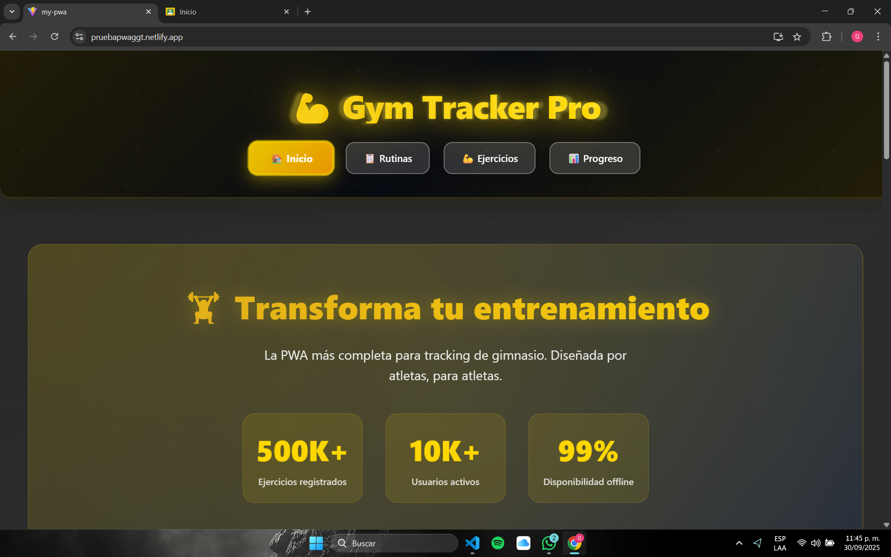 | 🌟 **PWA Cargada** - Aplicación funcionando con tema dorado premium |
| **2️⃣** | 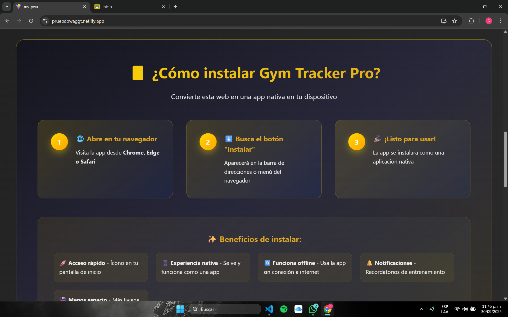 | 🔍 **Detección PWA** - El navegador detecta la PWA y muestra opción de instalación |
| **3️⃣** | 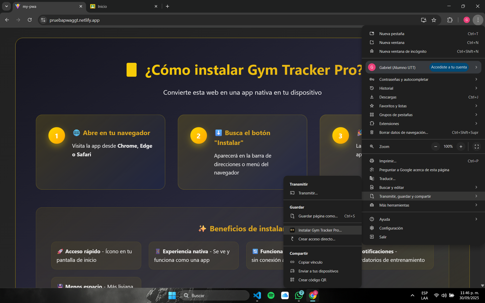 | ⚙️ **Proceso de Instalación** - Confirmando instalación en el sistema |
| **4️⃣** | 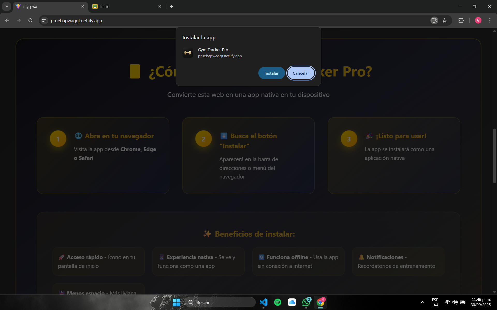 | 🏁 **Finalizando** - Completando la configuración de la PWA |
| **5️⃣** | 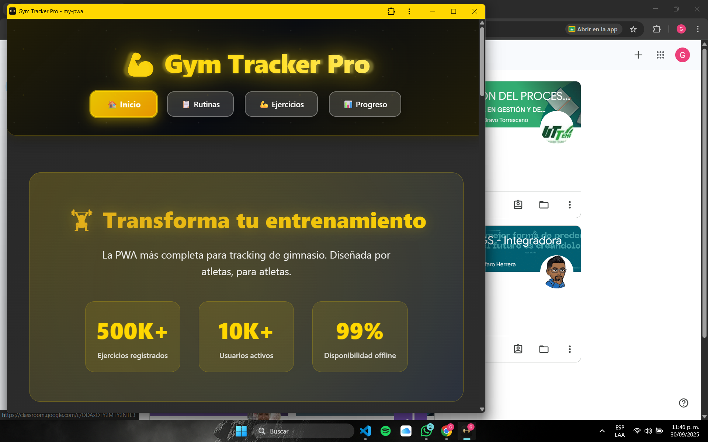 | ✅ **Instalación Exitosa** - Gym Tracker Pro funcionando como app nativa |
| **6️⃣** | 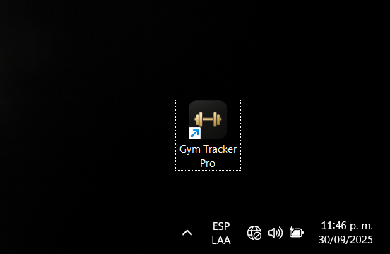 | 🖼️ **Integración del Sistema** - Ícono disponible en menú de aplicaciones |
| **7️⃣** | 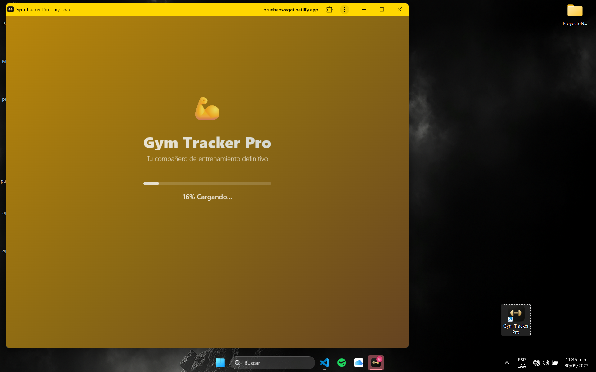 | 🌟 **Splash Screen Offline** - Pantalla de carga funcionando sin internet |
| **8️⃣** | 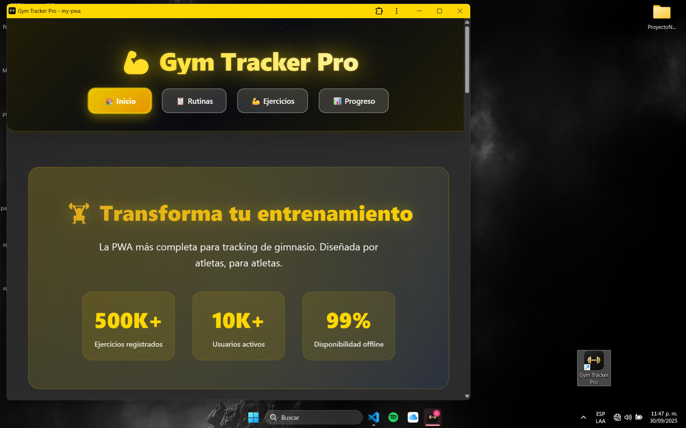 | 🌐 **Funcionalidad Completa Offline** - App 100% funcional sin conexión |

</div>

</details>

<div align="center">

---

### 📱 **Móvil - Android/iOS**


</div>

<details open>
<summary><strong>👆 Click para ver todas las capturas móviles</strong></summary>

<br>

<div align="center">

| 🔢 | 🖼️ Preview | 📝 Descripción |
|:---:|:---:|:---|
| **1️⃣** | 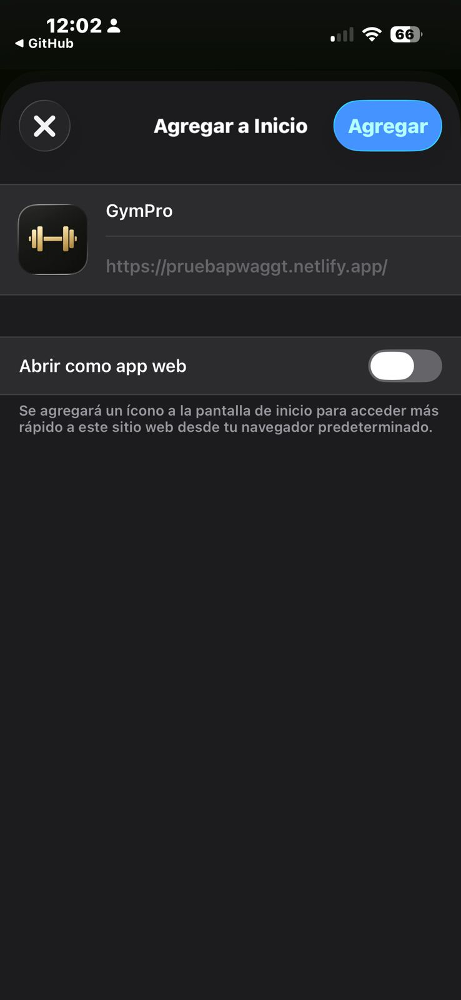 | 📲 **Proceso de Instalación** - Instalando PWA en dispositivo móvil |
| **2️⃣** | 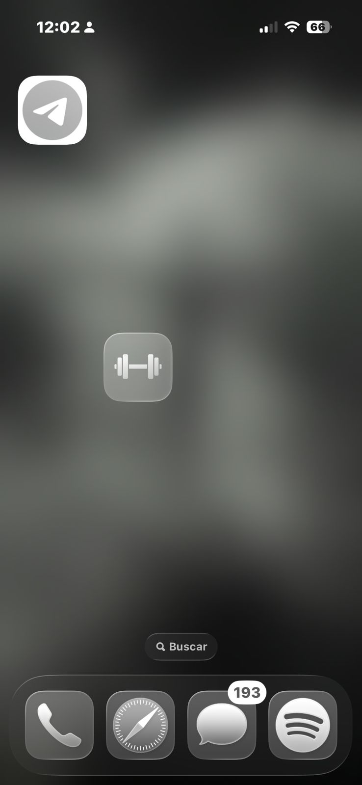 | ✅ **App Instalada** - Gym Tracker Pro integrada en el dispositivo |
| **3️⃣** | 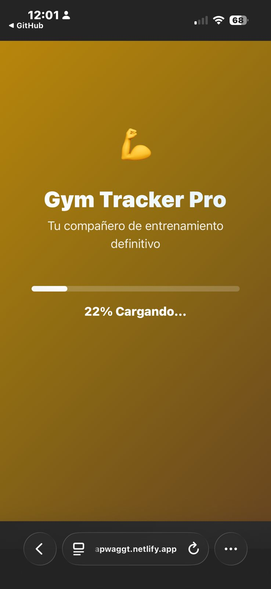 | 🌟 **Splash Screen Móvil** - Pantalla de carga optimizada para móvil |
| **4️⃣** | 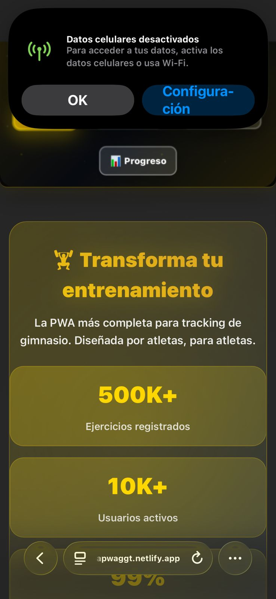 | 🌐 **Offline Completo** - Funcionalidad total sin conexión a internet |

</div>

</details>

<div align="center">

### 🎯 **Puntos Clave de la Instalación**

<table>
<tr>
<td align="center" width="25%">
  
  <br><strong>Instalación Rápida</strong>
  <br><em>Un solo click</em>
</td>
<td align="center" width="25%">
  
  <br><strong>100% Offline</strong>
  <br><em>Sin internet</em>
</td>
<td align="center" width="25%">
  
  <br><strong>Experiencia Nativa</strong>
  <br><em>Como app real</em>
</td>
</tr>
</table>

</div>

---

## 🏗️ **Estructura del Proyecto**

<div align="center">

```
📁 my-pwa/
├── 📁 public/
│   ├── 📄 manifest.json       ← 📱 Web App Manifest
│   ├── ⚙️ sw.js               ← 🔧 Service Worker
│   ├── 🖼️ vite.svg            ← 🎨 Assets
│   └── 📁 icons/
│       └── 💪 icon.png        ← 📱 PWA Icons
├── 📁 src/
│   ├── ⚛️ App.tsx             ← 🏗️ App Shell + Components
│   ├── 🎨 App.css             ← ✨ Styles & Animations
│   ├── 🎨 index.css           ← 🌐 Global Styles
│   ├── 🚀 main.tsx            ← 📱 SW Registration
│   └── 📁 assets/
│       └── ⚛️ react.svg       ← 🎨 React Assets
├── 📁 Screenshots/            ← 📸 Demo Images
│   ├── 📁 Desktop_Caps/       ← 🖥️ Desktop Screenshots
│   └── 📁 Mobile_Caps/        ← 📱 Mobile Screenshots
├── ⚙️ vite.config.ts          ← ⚡ Vite Configuration
├── ⚙️ workbox-config.js       ← 📦 Workbox Setup
├── 📝 tsconfig.json           ← 📘 TypeScript Config
└── 📋 package.json            ← 📦 Dependencies
```

</div>

---

## 📄 **Archivos Clave PWA**

<div align="center">

### **📱 manifest.json**

</div>

<details>
<summary>👆 <strong>Click para ver configuración completa</strong></summary>

```json
{
  "name": "Gym Tracker Pro - Progressive Web App",
  "short_name": "Gym Tracker Pro",
  "description": "Aplicación PWA para tracking de gimnasio",
  "start_url": "/",
  "display": "standalone",
  "background_color": "#000000",
  "theme_color": "#FFD700",
  "icons": [
    {
      "src": "/icons/icon-72x72.png",
      "sizes": "72x72",
      "type": "image/png",
      "purpose": "maskable any"
    },
    {
      "src": "/icons/icon-96x96.png", 
      "sizes": "96x96",
      "type": "image/png",
      "purpose": "maskable any"
    },
    {
      "src": "/icons/icon-128x128.png",
      "sizes": "128x128", 
      "type": "image/png",
      "purpose": "maskable any"
    },
    {
      "src": "/icons/icon-144x144.png",
      "sizes": "144x144",
      "type": "image/png", 
      "purpose": "maskable any"
    },
    {
      "src": "/icons/icon-152x152.png",
      "sizes": "152x152",
      "type": "image/png",
      "purpose": "maskable any" 
    },
    {
      "src": "/icons/icon-192x192.png",
      "sizes": "192x192",
      "type": "image/png",
      "purpose": "maskable any"
    },
    {
      "src": "/icons/icon-384x384.png", 
      "sizes": "384x384",
      "type": "image/png",
      "purpose": "maskable any"
    },
    {
      "src": "/icons/icon-512x512.png",
      "sizes": "512x512", 
      "type": "image/png",
      "purpose": "maskable any"
    }
  ]
}
```

</details>

### **⚙️ Service Worker (sw.js)**

<div align="center">

<details>
<summary>👆 <strong>Click para ver implementación completa</strong></summary>

```javascript
const CACHE_NAME = 'gym-tracker-v2';
const urlsToCache = [
  '/',
  '/static/js/bundle.js',
  '/static/css/main.css', 
  '/manifest.json',
  '/icons/icon-192x192.png',
  '/icons/icon-512x512.png'
];

// 🔧 Instalación - Cachear App Shell
self.addEventListener('install', (event) => {
  console.log('💪 Service Worker: Instalando...');
  event.waitUntil(
    caches.open(CACHE_NAME)
      .then((cache) => {
        console.log('📦 Cache abierto');
        return cache.addAll(urlsToCache);
      })
      .then(() => {
        console.log('✅ App Shell cacheado exitosamente');
      })
  );
});

// 🔄 Intercepción - Cache-First Strategy  
self.addEventListener('fetch', (event) => {
  event.respondWith(
    caches.match(event.request)
      .then((response) => {
        // 🎯 Cache hit - retornar desde cache
        if (response) {
          console.log('💾 Sirviendo desde cache:', event.request.url);
          return response;
        }
        
        // 🌐 Cache miss - fetch desde red y cachear
        console.log('🌐 Fetching desde red:', event.request.url);
        return fetch(event.request)
          .then((response) => {
            // ✅ Verificar respuesta válida
            if (!response || response.status !== 200 || response.type !== 'basic') {
              return response;
            }

            // 📦 Clonar respuesta y cachear
            const responseToCache = response.clone();
            caches.open(CACHE_NAME)
              .then((cache) => {
                cache.put(event.request, responseToCache);
              });

            return response;
          });
      })
  );
});

// 🔄 Activación - Limpiar caches antiguas
self.addEventListener('activate', (event) => {
  console.log('🚀 Service Worker: Activando...');
  event.waitUntil(
    caches.keys().then((cacheNames) => {
      return Promise.all(
        cacheNames.map((cacheName) => {
          if (cacheName !== CACHE_NAME) {
            console.log('🗑️ Eliminando cache antigua:', cacheName);
            return caches.delete(cacheName);
          }
        })
      );
    })
  );
});
```

</div>

</details>

---

## 🛠️ **Instalación y Desarrollo**

<div align="center">

### 🚀 **Quick Start**

</div>

<div align="center">

```bash
# 📥 Clonar repositorio
git clone https://github.com/Gabo02GT/PruebaPWA.git

# 📂 Navegar al directorio
cd my-pwa

# 📦 Instalar dependencias
npm install

# ⚡ Iniciar servidor de desarrollo
npm run dev

# 🏗️ Construir para producción
npm run build

# 👀 Preview de producción
npm run preview
```

</div>

<div align="center">

### 🌐 **Probar PWA en Producción**

**🔗 Demo Live:** [https://pruebapwaggt.netlify.app/](https://pruebapwaggt.netlify.app/)

</div>

#### **📱 Pasos para probar instalación:**

<div align="center">

1. **🌐 Abrir** → Chrome/Edge en el enlace de demo
2. **🔍 Buscar** → Botón "Instalar" en la barra de direcciones  
3. **📲 Instalar** → Seguir el proceso de instalación
4. **✈️ Probar offline** → Desconectar internet y verificar funcionamiento

</div>

---

## � **Tech Stack & Herramientas**

<div align="center">

### 💻 **Tecnologias Frontend**

<table>
<tr>
<td align="center" width="25%">
  <div style="background: linear-gradient(135deg, #61DAFB 0%, #21325B 100%); padding: 20px; border-radius: 15px;">
    
    <br><br>
    <strong style="color: #61DAFB;">React 18</strong>
    <br><em>⚛️ UI Framework</em>
    <br><small>Hooks • Components • State</small>
  </div>
</td>
<td align="center" width="25%">
  <div style="background: linear-gradient(135deg, #3178C6 0%, #1E3A8A 100%); padding: 20px; border-radius: 15px;">
    
    <br><br>
    <strong style="color: #3178C6;">TypeScript</strong>
    <br><em>📘 Type Safety</em>
    <br><small>Static Types • IntelliSense</small>
  </div>
</td>
<td align="center" width="25%">
  <div style="background: linear-gradient(135deg, #646CFF 0%, #4338CA 100%); padding: 20px; border-radius: 15px;">
    
    <br><br>
    <strong style="color: #646CFF;">Vite</strong>
    <br><em>⚡ Build Tool</em>
    <br><small>HMR • Fast • Optimized</small>
  </div>
</td>
</tr>
</table>

### 🎨 **Estilo y diseño**

<div align="center">

<div>
  
  
  
  
</div>

</div>

### ⚙️ **Herramientas de desarrollo**

<div align="center">

<div>
  
  
  
</div>

</div>

</div>

### 📦 **Dependencies Overview**

<div align="center">

| Core Package | Version | Purpose | Status |
|--------------|---------|---------|--------|
| `react` | `^18.2.0` | ⚛️ Core React library | ✅ Latest |
| `react-dom` | `^18.2.0` | 🌐 React DOM bindings | ✅ Latest |
| `typescript` | `^5.0.2` | 📘 Type checking & safety | ✅ Latest |
| `vite` | `^4.4.5` | ⚡ Lightning-fast build tool | ✅ Latest |
| `workbox-precaching` | `^7.0.0` | 💾 Precaching strategies | ✅ Latest |
| `workbox-routing` | `^7.0.0` | �️ Request routing | ✅ Latest |
| `workbox-strategies` | `^7.0.0` | 🎯 Caching strategies | ✅ Latest |

</div>

---

<div align="center">

## 🎊 **¡Gracias por visitar mi proyecto!**


---

### 👨‍💻 **Desarrollado con ❤️ por**

<table>
<tr>
<td align="center">
  <sub><b>🧑‍💻 Gabriel Garcia</b></sub><br>
  <sub>📅 Septiembre 2025</sub>
</td>
</tr>
</table>

---

### 🏆 **Estado del Proyecto**

<div>
  
  
  
  
</div>

<br>

<div>
  
  
  
  
</div>

---

### 🌟 **Si te gustó este proyecto**

<table>
<tr>
<td align="center">
  <a href="https://github.com/Gabo02GT/PruebaPWA">
    
  </a>
  <br>
  <sub>⭐ Dale una estrella</sub>
</td>
<td align="center">
  <a href="https://github.com/Gabo02GT">
    
  </a>
  <br>
  <sub>👤 Sígueme en GitHub</sub>
</td>
</tr>
</table>

---


</div>
